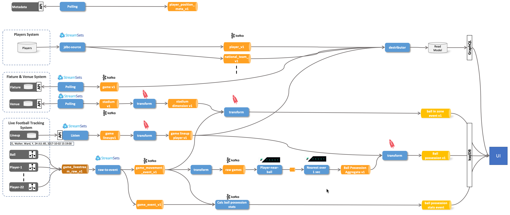
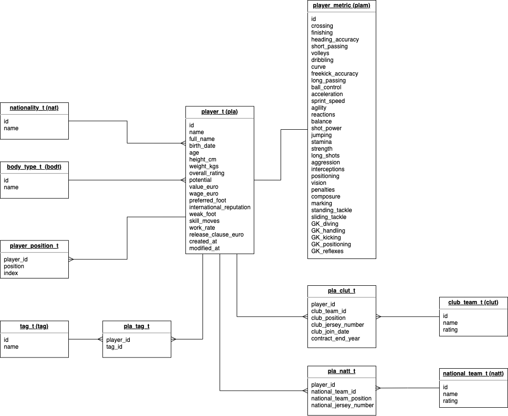

# Soccer Streaming Demo

This project shows how to setup and run the demo used ... 



## Prerequistes

The platform where the demos can be run on, has been generated using the [`platys`](http://github.com/trivadispf/platys)  toolset using the [`platys-modern-data-platform`](http://github.com/trivadispf/platys-modern-data-platform) stack.

The generated artefacts are available in the `./docker` folder.

The prerequisites for running the platform are 
 
 * Docker 
 * Docker Compose
 * Platys 

The environment is completely based on docker containers. In order to easily start the multiple containers, we are going to use Docker Compose. You need to have at least 8 GB of RAM available, better is 12 GB or 16 GB.

### Start the platform using Docker Compose (tbd.)

First, create the following two environment variables, which export the Public IP address (if a cloud environment) and the Docker Engine (Docker Host)  IP address:

``` bash
export DOCKER_HOST_IP=<docker-host-ip>
export PUBLIC_IP=<public-host-ip>
```

You can either add them to `/etc/environment` (without export) to make them persistent or use an `.env` file inside the `docker` folder with the two variables.

It is very important that these two are set, otherwise the platform will not run properly.

Now navigate into the `docker` folder and start `docker-compose`.

``` bash
cd ./docker

docker-compose up -d
```

To show all logs of all containers use

``` bash
docker-compose logs -f
```

To show only the logs for some of the containers, for example `kafka-connect-1` and `kafka-connect-2`, use


``` bash
docker-compose logs -f kafka-connect-1 kafka-connect-2
```

Some services in the `docker-compose.yml` are optional and can be removed, if you don't have enough resources to start them. 

As a final step, add `dataplatform` as an alias to the `/etc/hosts` file so that the links used in this document work. 

```
<public-host-ip>		dataplatform
```

If you have no rights for doing that, then you have to use your IP address instead of `dataplatform` in all the URLs.  


## Preparation

### Create Kafka Topics

```bash
docker exec -ti kafka-1 kafka-topics --create --zookeeper zookeeper-1:2181 --topic game_v1 --replication-factor 3 --partitions 1 --config cleanup.policy=compact --config segment.ms=100 --config delete.retention.ms=100 --config min.cleanable.dirty.ratio=0.001 &&
	
docker exec -ti kafka-1 kafka-topics --create --zookeeper zookeeper-1:2181 --topic stadium_v1 --replication-factor 3 --partitions 1 --config cleanup.policy=compact --config segment.ms=100 --config delete.retention.ms=100 --config min.cleanable.dirty.ratio=0.001 &&

docker exec -ti kafka-1 kafka-topics --create --zookeeper zookeeper-1:2181 --topic player_v1 --replication-factor 3 --partitions 1 &&

docker exec -ti kafka-1 kafka-topics --create --zookeeper zookeeper-1:2181 --topic player_position_meta_v1 --replication-factor 3 --partitions 1 &&

docker exec -ti kafka-1 kafka-topics --create --zookeeper zookeeper-1:2181 --topic stadium_dimension_v1 --replication-factor 3 --partitions 1 &&


docker exec -ti kafka-1 kafka-topics --create --zookeeper zookeeper-1:2181 --topic game_lineup_v1 --replication-factor 3 --partitions 1 --config cleanup.policy=compact --config segment.ms=100 --config delete.retention.ms=100 --config min.cleanable.dirty.ratio=0.001 &&

docker exec -ti kafka-1 kafka-topics --create --zookeeper zookeeper-1:2181 --topic game_livestream_raw_v1 --replication-factor 3 --partitions 1 &&


docker exec -ti kafka-1 kafka-topics --create --zookeeper zookeeper-1:2181 --topic game_movement_event_v1 --replication-factor 3 --partitions 1 &&

docker exec -ti kafka-1 kafka-topics --create --zookeeper zookeeper-1:2181 --topic game_start_event_v1 --replication-factor 3 --partitions 1 &&

docker exec -ti kafka-1 kafka-topics --create --zookeeper zookeeper-1:2181 --topic ball_in_zone_event_v1 --replication-factor 3 --partitions 1 &&

docker exec -ti kafka-1 kafka-topics --create --zookeeper zookeeper-1:2181 --topic ball_possession_event_v1 --replication-factor 3 --partitions 1 &&

docker exec -ti kafka-1 kafka-topics --create --zookeeper zookeeper-1:2181 --topic ball_possession_stats_event_v1 --replication-factor 3 --partitions 1 &&


docker exec -ti kafka-1 kafka-topics --create --zookeeper zookeeper-1:2181 --topic rawGames --replication-factor 3 --partitions 1
```

## UI 

The following streams are consumed by the UI:

Getting the *ball in zone* events:

```sql
SELECT * FROM ball_in_zone_event_t WHERE ball_event IS NOT NULL EMIT CHANGES;
```

Getting the *ball possession* events:
	
```sql
SELECT * FROM ball_possession_event_s emit changes;
```

Getting the *ball possession statistics* events:

```sql
SELECT * FROM ball_possession_stats_event_s emit changes;
```


## Source Systems

### Players System 

The data for the players system has been taken from the following dataset: <https://data.world/raghav333/fifa-players>.

It has been "wrangled" using Spark. The code can be found in the Zeppelin notebook: `src/zeppelin/fifa-cleaned-wrangler.zpln`. Before it can be executed, the data needs to be available in S3 (Minio):

```
docker exec -ti awscli s3cmd mb s3://soccer-bucket
docker exec -ti awscli s3cmd put /data-transfer/fifa_cleaned.csv s3://soccer-bucket/raw/
docker exec -ti awscli s3cmd put /data-transfer/football-positions.csv s3://soccer-bucket/raw/
```

The Data Model for the Players system 



After the wrangling, the CSV Files are available in this folder [./data/player_source_system/soccer-bucket-raw_csv](./data/player_source_system/soccer-bucket-raw_csv). The script for creating the database model is available here: [./src/scripts/football.sql](./src/scripts/football.sql)


### Fixture & Venue System 


### Live Football Tracking System


## Football Data Hub

### Metadata

For player positions the data in this csv file [./data/football-positions.csv](./data/football-positions.csv) is what is used in football data hub.


## Stream Data Ingestion

## Stream Processing

### Game Livestream System 


``` bash
docker exec -it ksqldb-cli ksql http://ksqldb-server-1:8088
```

Create a Stream on the lineup data

```
DROP STREAM game_lineup_event_s;

CREATE STREAM game_lineup_event_s (id VARCHAR KEY)
WITH (KAFKA_TOPIC='game_lineup_v1', VALUE_FORMAT='AVRO', VALUE_AVRO_SCHEMA_FULL_NAME='GameLineupEventV1');

CREATE STREAM game_lineup_players_event_s 
WITH (KAFKA_TOPIC='game_lineup_players_v1', PARTITIONS=1, REPLICAS=3, VALUE_FORMAT='AVRO', KEY_FORMAT='KAFKA', VALUE_AVRO_SCHEMA_FULL_NAME='GameLineupPlayersEvent')
AS 
SELECT id
		, matchId 
		,'home' as team
		, explode(hometeamplayers) AS player
FROM game_lineup_s
EMIT CHANGES;

INSERT INTO game_lineup_players_event_s 
SELECT id
		, matchId 
		,'away' as team
		, explode(awayteamplayers) AS player
FROM game_lineup_s
EMIT CHANGES;

SELECT id, matchId, team, player->playerid FROM game_lineup_players_s EMIT CHANGES;

DROP TABLE game_lineup_player_t;

CREATE TABLE game_lineup_player_t
WITH (KAFKA_TOPIC='game_lineup_player_v1', PARTITIONS=1, REPLICAS=3, VALUE_FORMAT='AVRO', KEY_FORMAT='KAFKA', VALUE_AVRO_SCHEMA_FULL_NAME='GameLineupPlayer')
AS
SELECT latest_by_offset (matchId) AS matchId
			, latest_by_offset (team) AS team
			, player->sensorId	AS sensorId
			, latest_by_offset (player->position) AS position
			, latest_by_offset (player->playerId) AS playerId
FROM game_lineup_players_event_s 
GROUP BY player->sensorId
EMIT CHANGES;

SELECT * FROM game_lineup_player_t emit changes;
```

Create a Stream on the livestream raw data

```sql
DROP STREAM game_position_s;

CREATE STREAM game_position_event_s (id VARCHAR KEY)
WITH (KAFKA_TOPIC='game_position_event_v1', VALUE_FORMAT='AVRO', VALUE_AVRO_SCHEMA_FULL_NAME='GamePositionEventV1');
```

```
curl -X POST -H 'Content-Type: application/vnd.ksql.v1+avro' -i http://dataplatform:8088/query --data '{
  "ksql": "SELECT * FROM fixture_livestream_s EMIT CHANGES;",
  "streamsProperties": {
    "ksql.streams.auto.offset.reset": "latest"
  }
}'
```

## Stadium Dimension Metadata

```
DROP TABLE stadium_t;

CREATE TABLE stadium_t (
  id VARCHAR PRIMARY KEY, 
  name VARCHAR, 
  pitchYSize DOUBLE, 
  pitchYSize DOUBLE) 
WITH (KAFKA_TOPIC='stadium_v1', PARTITIONS=1, REPLICAS=3, VALUE_FORMAT='AVRO', KEY_FORMAT='KAFKA');

DROP TABLE stadium_dimension_t;

CREATE TABLE stadium_dimension_t 
WITH (KAFKA_TOPIC='stadium_dimension-v1', PARTITIONS=1, REPLICAS=3, VALUE_FORMAT='AVRO', KEY_FORMAT='KAFKA', VALUE_AVRO_SCHEMA_FULL_NAME='StadiumDimensionV1')
as
select
  id,
  name, 
  STRUCT( Xmin := -(pitchXSize/2), Xmax := (pitchXSize/2), Ymin := -(pitchYSize/2), Ymax := (pitchYSize/2)) AS pitch,
  STRUCT( Xmin := -(pitchXSize/2), Xmax := 0, Ymin := -(pitchYSize/2), Ymax := (pitchYSize/2)) AS pitchLeft, 
  STRUCT( Xmin := 0, Xmax := (pitchXSize/2), Ymin := -(pitchYSize/2), Ymax := (pitchYSize/2)) AS pitchRight, 
  STRUCT( Xmin := -(pitchXSize/2), Xmax := -(pitchXSize/2)+16.5, Ymin := (-20.16), Ymax := 20.16) AS penaltyBoxLeft, 
  STRUCT( Xmin := (pitchXSize/2)-16.5, Xmax := (pitchXSize/2), Ymin := (-20.16), Ymax := 20.16) AS penaltyBoxRight, 
  STRUCT( Xmin := -(pitchXSize/2)-2.0, Xmax := -(pitchXSize/2), Ymin := -3.66, Ymax := 3.66 ) AS goalLeft, 
  STRUCT( Xmin := (pitchXSize/2), Xmax := (pitchXSize/2)+2.0, Ymin := (-3.66), Ymax := 3.66 ) AS goalRight
FROM stadium_t
EMIT CHANGES;
```

```
|19060518            |Estádio do Dragão   |{XMIN=-52.5, XMAX=52|{XMIN=-52.5, XMAX=0,|{XMIN=0, XMAX=52.5, |{XMIN=-52.5, XMAX=-3|{XMIN=36.0, XMAX=52.|{XMIN=-54.5, XMAX=-5|{XMIN=52.5, XMAX=54.|
|                    |                    |.5, YMIN=-34.0, YMAX| YMIN=-34.0, YMAX=34|YMIN=-34.0, YMAX=34.|6.0, YMIN=-20.16, YM|5, YMIN=-20.16, YMAX|2.5, YMIN=-3.66, YMA|5, YMIN=-3.66, YMAX=|
|                    |                    |=34.0}              |.0}                 |0}                  |AX=20.16}           |=20.16}             |X=3.66}             |3.66}               |
```


### Ball in Zone

```
DROP STREAM ball_in_zone_s;

CREATE STREAM ball_in_zone_s
WITH ( kafka_topic = 'ball_in_zone_v1', PARTITIONS=1, REPLICAS=1, VALUE_FORMAT='AVRO', VALUE_AVRO_SCHEMA_FULL_NAME='BallInZoneV1')
AS
SELECT gpe.id
       , gpe.ts
		, gpe.x
		, gpe.y
		, gpe.playerId
		, stad.id as matchid
  , CASE WHEN x > pitch->Xmin AND x < pitch->Xmax AND y > pitch->Ymin AND y < pitch->Ymax THEN 1 ELSE 0 END AS isOnPitch,
  CASE WHEN x < pitchLeft->Xmax THEN 1 ELSE 0 END AS isPitchLeft,
  CASE WHEN x > pitchRight->Xmin THEN 1 ELSE 0 END AS isPitchRight,
  CASE WHEN x > penaltyBoxLeft->Xmin AND x < penaltyBoxLeft->Xmax AND y > penaltyBoxLeft->Ymin AND y < penaltyBoxLeft->Ymax THEN 1 ELSE 0 END AS isPenaltyBoxLeft,
  CASE WHEN x > penaltyBoxRight->Xmin AND x < penaltyBoxRight->Xmax AND y > penaltyBoxRight->Ymin AND y < penaltyBoxRight->Ymax THEN 1 ELSE 0 END AS isPenaltyBoxRight,
  CASE WHEN x > goalLeft->Xmin AND x < goalLeft->Xmax AND y > goalLeft->Ymin AND y < goalLeft->Ymax THEN 1 ELSE 0 END AS isGoalLeft,
  CASE WHEN x > goalRight->Xmin AND x < goalRight->Xmax AND y > goalRight->Ymin AND y < goalRight->Ymax THEN 1 ELSE 0 END AS isGoalRight
FROM game_position_event_s 	gpe
INNER JOIN stadium_dimension_t stad 
	ON cast(gpe.matchId as varchar) = stad.id
WHERE gpe.playerId = 200
EMIT CHANGES;
```

This one is not used!!

```
DROP TABLE ball_in_zone_event_t;

CREATE TABLE ball_in_zone_event_t
WITH ( kafka_topic = 'ball_in_zone_event_v1', PARTITIONS=1, REPLICAS=1, VALUE_FORMAT='AVRO')
AS
SELECT matchId
		, CASE WHEN ARRAY_JOIN (LATEST_BY_OFFSET(isOnPitch,2), ':') = '1:0' THEN 'leave' 
		       WHEN ARRAY_JOIN (LATEST_BY_OFFSET(isOnPitch,2), ':') = '0:1' THEN 'enter'  
		       WHEN ARRAY_JOIN (LATEST_BY_OFFSET(isOnPitch,2), ':') = '0:0' THEN 'outside'  		       WHEN ARRAY_JOIN (LATEST_BY_OFFSET(isOnPitch,2), ':') = '1:1' THEN 'inside'  
		       ELSE NULL
		  END AS onPitchEvent		
		, CASE WHEN ARRAY_JOIN (LATEST_BY_OFFSET(isPitchLeft,2), ':') = '1:0' THEN 'leave' 
		       WHEN ARRAY_JOIN (LATEST_BY_OFFSET(isPitchLeft,2), ':') = '0:1' THEN 'enter'  
		       WHEN ARRAY_JOIN (LATEST_BY_OFFSET(isPitchLeft,2), ':') = '0:0' THEN 'outside'  		       WHEN ARRAY_JOIN (LATEST_BY_OFFSET(isPitchLeft,2), ':') = '1:1' THEN 'inside'  
		       ELSE NULL
		  END AS pitchLeftEvent		
		, CASE WHEN ARRAY_JOIN (LATEST_BY_OFFSET(isPitchRight,2), ':') = '1:0' THEN 'leave' 
		       WHEN ARRAY_JOIN (LATEST_BY_OFFSET(isPitchRight,2), ':') = '0:1' THEN 'enter'  
		       WHEN ARRAY_JOIN (LATEST_BY_OFFSET(isPitchRight,2), ':') = '0:0' THEN 'outside'  		       WHEN ARRAY_JOIN (LATEST_BY_OFFSET(isPitchRight,2), ':') = '1:1' THEN 'inside'  
		       ELSE NULL
		  END AS pitchRightEvent		
		, CASE WHEN ARRAY_JOIN (LATEST_BY_OFFSET(isGoalLeft,2), ':') = '1:0' THEN 'leave' 
		       WHEN ARRAY_JOIN (LATEST_BY_OFFSET(isGoalLeft,2), ':') = '0:1' THEN 'enter'  
		       WHEN ARRAY_JOIN (LATEST_BY_OFFSET(isGoalLeft,2), ':') = '0:0' THEN 'outside'  		       WHEN ARRAY_JOIN (LATEST_BY_OFFSET(isGoalLeft,2), ':') = '1:1' THEN 'inside'  
		       ELSE NULL
		  END AS goalLeftEvent
		, CASE WHEN ARRAY_JOIN (LATEST_BY_OFFSET(isGoalRight,2), ':') = '1:0' THEN 'leave' 
		       WHEN ARRAY_JOIN (LATEST_BY_OFFSET(isGoalRight,2), ':') = '0:1' THEN 'enter'  
		       WHEN ARRAY_JOIN (LATEST_BY_OFFSET(isGoalRight,2), ':') = '0:0' THEN 'outside'  		       WHEN ARRAY_JOIN (LATEST_BY_OFFSET(isGoalRight,2), ':') = '1:1' THEN 'inside'  
		       ELSE NULL
		  END AS goalRightEvent		  
		, CASE WHEN ARRAY_JOIN (LATEST_BY_OFFSET(isPenaltyBoxLeft,2), ':') = '1:0' THEN 'leave' 
		       WHEN ARRAY_JOIN (LATEST_BY_OFFSET(isPenaltyBoxLeft,2), ':') = '0:1' THEN 'enter'  
		       WHEN ARRAY_JOIN (LATEST_BY_OFFSET(isPenaltyBoxLeft,2), ':') = '0:0' THEN 'outside'  		       WHEN ARRAY_JOIN (LATEST_BY_OFFSET(isPenaltyBoxLeft,2), ':') = '1:1' THEN 'inside'  
		       ELSE NULL
		  END AS penaltyBoxLeftEvent
		, CASE WHEN ARRAY_JOIN (LATEST_BY_OFFSET(isPenaltyBoxRight,2), ':') = '1:0' THEN 'leave' 
		       WHEN ARRAY_JOIN (LATEST_BY_OFFSET(isPenaltyBoxRight,2), ':') = '0:1' THEN 'enter'  
		       WHEN ARRAY_JOIN (LATEST_BY_OFFSET(isPenaltyBoxRight,2), ':') = '0:0' THEN 'outside'  		       WHEN ARRAY_JOIN (LATEST_BY_OFFSET(isPenaltyBoxRight,2), ':') = '1:1' THEN 'inside'  
		       ELSE NULL
		  END AS penaltyBoxRightEvent
FROM ball_in_zone_s
GROUP BY matchId
EMIT CHANGES;
```

```
DROP TABLE ball_in_zone_event_t;

CREATE TABLE ball_in_zone_event_t
WITH ( kafka_topic = 'ball_in_zone_event_v1', PARTITIONS=1, REPLICAS=1, VALUE_FORMAT='AVRO',  VALUE_AVRO_SCHEMA_FULL_NAME='BallInZoneEventV1')
AS
SELECT matchId
	, CASE WHEN ARRAY_JOIN (LATEST_BY_OFFSET(isPenaltyBoxRight,2), ':') = '0:1' THEN 'enter penalty box Switzerland'
			WHEN ARRAY_JOIN (LATEST_BY_OFFSET(isPenaltyBoxRight,2), ':') = '1:0' THEN 'left penalty box Switzerland'
			WHEN ARRAY_JOIN (LATEST_BY_OFFSET(isPenaltyBoxLeft,2), ':') = '0:1' THEN 'enter penalty box Portugal'
			WHEN ARRAY_JOIN (LATEST_BY_OFFSET(isPenaltyBoxLeft,2), ':') = '0:1' THEN 'left penalty box Portugal'
			WHEN ARRAY_JOIN (LATEST_BY_OFFSET(isGoalRight,2), ':') = '0:1' THEN 'enter goal right'
			WHEN ARRAY_JOIN (LATEST_BY_OFFSET(isGoalLeft,2), ':') = '0:1' THEN 'enter goal left'
			WHEN ARRAY_JOIN (LATEST_BY_OFFSET(isPitchLeft,2), ':') = '0:1' THEN 'enter pitch Portugal'
			WHEN ARRAY_JOIN (LATEST_BY_OFFSET(isPitchRight,2), ':') = '0:1' THEN 'enter pitch Switzerland'
	END AS ball_event
FROM ball_in_zone_s
GROUP BY matchId
HAVING ARRAY_JOIN (LATEST_BY_OFFSET(isPitchLeft,2), ':') = '0:1'
OR ARRAY_JOIN (LATEST_BY_OFFSET(isPitchRight,2), ':') = '0:1'
OR ARRAY_JOIN (LATEST_BY_OFFSET(isGoalLeft,2), ':') = '0:1'
OR ARRAY_JOIN (LATEST_BY_OFFSET(isGoalRight,2), ':') = '0:1'
OR ARRAY_JOIN (LATEST_BY_OFFSET(isPenaltyBoxLeft,2), ':') IN ('0:1','1:0')
OR ARRAY_JOIN (LATEST_BY_OFFSET(isPenaltyBoxRight,2), ':') IN ('0:1','1:0')
EMIT CHANGES;
```

```
SELECT * FROM ball_in_zone_event_t WHERE ball_event IS NOT NULL EMIT CHANGES;
```


curl -X POST -H 'Content-Type: application/vnd.ksql.v1+json' -i http://dataplatform:8088/query --data '{
  "ksql": "SELECT * FROM ball_in_zone_event_t WHERE ball_event IS NOT NULL EMIT CHANGES;",
  "streamsProperties": {
    "ksql.streams.auto.offset.reset": "latest"
  }
}'


### Ball Possession


rawGames

```
DROP STREAM ball_possession_aggregate_s;

CREATE STREAM ball_possession_aggregate_s (
  id BIGINT KEY,
  ts VARCHAR, 
  eventtype VARCHAR,
  sensorId INT,
  matchId INTEGER,
  playerKey VARCHAR) 
WITH (KAFKA_TOPIC='fbBallPossessionAggregate', PARTITIONS=1, REPLICAS=1, VALUE_FORMAT='JSON');
```

```
DROP STREAM ball_possession_event_s;

CREATE STREAM ball_possession_event_s
WITH (
    kafka_topic = 'ball_possession_event_v1',
    PARTITIONS=1, 
    REPLICAS=1,
    VALUE_FORMAT='AVRO',
    VALUE_AVRO_SCHEMA_FULL_NAME='com.trivadis.demo.soccer.BallPossessionEventV1'
)
AS
SELECT
  id,
  stringtotimestamp(bp.ts, 'yyyy.MM.dd''T''HH:mm:ss.SSS') as ts,
  bp.ts as ts_string, 
  bp.eventtype as eventtype,
  bp.sensorId as sensorId,
  bp.matchId as matchId,
  glp.position as name,
  glp.playerId as playerId,
  glp.team as team,
  CASE WHEN (glp.team = 'home') THEN 1 ELSE 2 END as objectType
FROM ball_possession_aggregate_s bp
INNER JOIN game_lineup_player_t glp on glp.sensorId  = bp.sensorId
EMIT CHANGES;


SELECT * FROM ball_possession_event_s emit changes;
```


### Ball Possession Statistics

```
DROP STREAM ball_possession_duration_s;

CREATE STREAM ball_possession_stats_event_s 
WITH (KAFKA_TOPIC='ball_possession_stats_event_v1', VALUE_FORMAT='AVRO');
```

SELECT * FROM ball_possession_stats_event_s emit changes;


### Misc

```sql
CREATE TABLE match_raw_t (
  rowkey BIGINT PRIMARY KEY, 
  match_id BIGINT, 
  pitch_x_size DOUBLE, 
  pitch_y_size DOUBLE) 
WITH (KAFKA_TOPIC='match_raw_v1', 
		PARTITIONS=1, 
		REPLICAS=1, 
		VALUE_FORMAT='AVRO');
```

```sql
INSERT INTO raw_meta_data_match_t (rowkey, match_id, pitch_x_size , pitch_y_size) 
VALUES (19060518, 19060518, 105.0, 68.0);
```


```sql
CREATE STREAM raw_meta_data_match_s (
  rowkey BIGINT KEY, 
  match_id BIGINT, 
  pitch_x_size DOUBLE, 
  pitch_x_size DOUBLE) 
WITH (KAFKA_TOPIC='rawMetaMatch'
		, PARTITIONS=1
		, REPLICAS=1
		, VALUE_FORMAT='JSON');
```

-- Tabelle mit Topic fbFieldPos neu erstellen
CREATE TABLE t_fbFieldPos 
WITH (KAFKA_TOPIC='fbFieldPos', PARTITIONS=1, REPLICAS=1, VALUE_FORMAT='JSON')
as
select
  matchId, 
  STRUCT( Xmin := -(pitchXSize/2), Xmax := (pitchXSize/2), Ymin := -(pitchYSize/2), Ymax := (pitchYSize/2)) AS pitch,
  STRUCT( Xmin := -(pitchXSize/2), Xmax := 0, Ymin := -(pitchYSize/2), Ymax := (pitchYSize/2)) AS pitchLeft, 
  STRUCT( Xmin := 0, Xmax := (pitchXSize/2), Ymin := -(pitchYSize/2), Ymax := (pitchYSize/2)) AS pitchRight, 
  STRUCT( Xmin := -(pitchXSize/2), Xmax := -(pitchXSize/2)+16.5, Ymin := (-20.16), Ymax := 20.16) AS penaltyBoxLeft, 
  STRUCT( Xmin := (pitchXSize/2)-16.5, Xmax := (pitchXSize/2), Ymin := (-20.16), Ymax := 20.16) AS penaltyBoxRight, 
  STRUCT( Xmin := -(pitchXSize/2)-2.0, Xmax := -(pitchXSize/2), Ymin := -3.66, Ymax := 3.66 ) AS goalLeft, 
  STRUCT( Xmin := (pitchXSize/2), Xmax := (pitchXSize/2)+2.0, Ymin := (-3.66), Ymax := 3.66 ) AS goalRight
FROM t_rawMetaMatch
EMIT CHANGES;


This was the game

<https://de.uefa.com/uefanationsleague/match/2024419--portugal-vs-switzerland/stories/?iv=true>