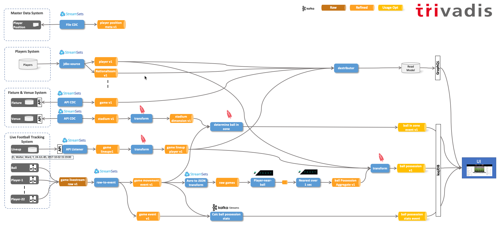

# Soccer Streaming Demo

This project shows how to setup and run the demo used ... 



## Prerequistes

The platform where the demos can be run on, has been generated using the [`platys`](http://github.com/trivadispf/platys)  toolset using the [`platys-modern-data-platform`](http://github.com/trivadispf/platys-modern-data-platform) stack.

The generated artefacts are available in the `./docker` folder.

The prerequisites for running the platform are 
 
 * Docker 
 * Docker Compose
 * Platys 

The environment is completely based on docker containers. In order to easily start the multiple containers, we are going to use Docker Compose. You need to have at least 8 GB of RAM available, better is 12 GB or 16 GB.

### Start the platform using Docker Compose (tbd.)

First, create the following two environment variables, which export the Public IP address (if a cloud environment) and the Docker Engine (Docker Host)  IP address:

``` bash
export DOCKER_HOST_IP=<docker-host-ip>
export PUBLIC_IP=<public-host-ip>
```

You can either add them to `/etc/environment` (without export) to make them persistent or use an `.env` file inside the `docker` folder with the two variables.

It is very important that these two are set, otherwise the platform will not run properly.

Now navigate into the `docker` folder and start `docker-compose`.

``` bash
cd ./docker

docker-compose up -d
```

To show all logs of all containers use

``` bash
docker-compose logs -f
```

To show only the logs for some of the containers, for example `kafka-connect-1` and `kafka-connect-2`, use


``` bash
docker-compose logs -f kafka-connect-1 kafka-connect-2
```

Some services in the `docker-compose.yml` are optional and can be removed, if you don't have enough resources to start them. 

As a final step, add `dataplatform` as an alias to the `/etc/hosts` file so that the links used in this document work. 

```
<public-host-ip>		dataplatform
```

If you have no rights for doing that, then you have to use your IP address instead of `dataplatform` in all the URLs.  


## Preparation

### Create Kafka Topics

```
docker exec -ti kafka-1 kafka-topics --create --zookeeper zookeeper-1:2181 --topic lineup_v1 --replication-factor 3 --partitions 1 &&

docker exec -ti kafka-1 kafka-topics --create --zookeeper zookeeper-1:2181 --topic fixture_v1 --replication-factor 3 --partitions 1 &&
	
docker exec -ti kafka-1 kafka-topics --create --zookeeper zookeeper-1:2181 --topic stadium_v1 --replication-factor 3 --partitions 1 &&

docker exec -ti kafka-1 kafka-topics --create --zookeeper zookeeper-1:2181 --topic player_v1 --replication-factor 3 --partitions 1 &&

docker exec -ti kafka-1 kafka-topics --create --zookeeper zookeeper-1:2181 --topic fixture_livestream_v1 --replication-factor 3 --partitions 1 &&

docker exec -ti kafka-1 kafka-topics --create --zookeeper zookeeper-1:2181 --topic ball_possession_v1 --replication-factor 3 --partitions 1 &&

docker exec -ti kafka-1 kafka-topics --create --zookeeper zookeeper-1:2181 --topic ball_in_zone_v1 --replication-factor 3 --partitions 1 &&

docker exec -ti kafka-1 kafka-topics --create --zookeeper zookeeper-1:2181 --topic player_position_meta_v1 --replication-factor 3 --partitions 1
```


## Source Systems

### Players System 

The data for the players system has been taken from the following dataset: <https://data.world/raghav333/fifa-players>.

It has been "wrangled" using Spark. The code can be found in the Zeppelin notebook: `src/zeppelin/fifa-cleaned-wrangler.zpln`. Before it can be executed, the data needs to be available in S3 (Minio):

```
docker exec -ti awscli s3cmd mb s3://soccer-bucket
docker exec -ti awscli s3cmd put /data-transfer/fifa_cleaned.csv s3://soccer-bucket/raw/
docker exec -ti awscli s3cmd put /data-transfer/football-positions.csv s3://soccer-bucket/raw/
```

The Data Model for the Players system 


After the wrangling, the CSV Files are available in this folder [./data/player_source_system/soccer-bucket-raw_csv](./data/player_source_system/soccer-bucket-raw_csv). The script for creating the database model is available here: [./src/scripts/football.sql](./src/scripts/football.sql)


### Fixture & Venue System 


### Live Football Tracking System


## Football Data Hub

### Metadata

For player positions the data in this csv file [./data/football-positions.csv](./data/football-positions.csv) is what is used in football data hub.


## Stream Data Ingestion

## Stream Processing


``` bash
docker exec -it ksqldb-cli ksql http://ksqldb-server-1:8088
```

Create a Stream on the livestream raw data

```sql
CREATE STREAM fixture_livestream_s
WITH (KAFKA_TOPIC='fixture_livestream_v1', VALUE_FORMAT='AVRO');
```


```
curl -X POST -H 'Content-Type: application/vnd.ksql.v1+avro' -i http://dataplatform:8088/query --data '{
  "ksql": "SELECT * FROM fixture_livestream_s EMIT CHANGES;",
  "streamsProperties": {
    "ksql.streams.auto.offset.reset": "latest"
  }
}'
```


```sql
CREATE TABLE match_raw_t (
  rowkey BIGINT PRIMARY KEY, 
  match_id BIGINT, 
  pitch_x_size DOUBLE, 
  pitch_y_size DOUBLE) 
WITH (KAFKA_TOPIC='match_raw_v1', 
		PARTITIONS=1, 
		REPLICAS=1, 
		VALUE_FORMAT='AVRO');
```

```sql
INSERT INTO raw_meta_data_match_t (rowkey, match_id, pitch_x_size , pitch_y_size) 
VALUES (19060518, 19060518, 105.0, 68.0);
```


```sql
CREATE STREAM raw_meta_data_match_s (
  rowkey BIGINT KEY, 
  match_id BIGINT, 
  pitch_x_size DOUBLE, 
  pitch_x_size DOUBLE) 
WITH (KAFKA_TOPIC='rawMetaMatch', PARTITIONS=1, REPLICAS=1, VALUE_FORMAT='JSON');
```

-- Tabelle mit Topic fbFieldPos neu erstellen
CREATE TABLE t_fbFieldPos 
WITH (KAFKA_TOPIC='fbFieldPos', PARTITIONS=1, REPLICAS=1, VALUE_FORMAT='JSON')
as
select
  matchId, 
  STRUCT( Xmin := -(PITCHXSIZE/2), Xmax := (PITCHXSIZE/2), Ymin := -(PITCHYSIZE/2), Ymax := (PITCHYSIZE/2)) AS pitch,
  STRUCT( Xmin := -(PITCHXSIZE/2), Xmax := 0, Ymin := -(PITCHYSIZE/2), Ymax := (PITCHYSIZE/2)) AS pitchLeft, 
  STRUCT( Xmin := 0, Xmax := (PITCHXSIZE/2), Ymin := -(PITCHYSIZE/2), Ymax := (PITCHYSIZE/2)) AS pitchRight, 
  STRUCT( Xmin := -(PITCHXSIZE/2), Xmax := -(PITCHXSIZE/2)+16.5, Ymin := (-20.16), Ymax := 20.16) AS penaltyBoxLeft, 
  STRUCT( Xmin := (PITCHXSIZE/2)-16.5, Xmax := (PITCHXSIZE/2), Ymin := (-20.16), Ymax := 20.16) AS penaltyBoxRight, 
  STRUCT( Xmin := -(PITCHXSIZE/2)-2.0, Xmax := -(PITCHXSIZE/2), Ymin := -3.66, Ymax := 3.66 ) AS goalLeft, 
  STRUCT( Xmin := (PITCHXSIZE/2), Xmax := (PITCHXSIZE/2)+2.0, Ymin := (-3.66), Ymax := 3.66 ) AS goalRight
FROM t_rawMetaMatch
EMIT CHANGES;


This was the game

<https://de.uefa.com/uefanationsleague/match/2024419--portugal-vs-switzerland/stories/?iv=true>