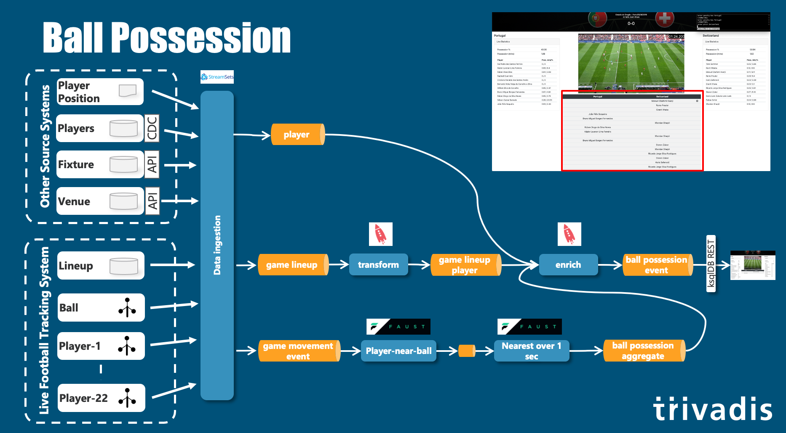

## Ball Possession (ksqlDB & Faust)



On my Mac

```
kafkacat -b dataplatform:9092 -t game_movement_event_v1 -s avro -r http://dataplatform:8081
```

Faust Player Near Ball [worker_fbRawGames.py](../src/faust/fbRawGames/worker_fbRawGames.py)

```python
def ballPossession(playerId, ballId, distance=3):
    dist = euclidianDistance((ballId[0], ballId[1], ballId[2]),(playerId[0], playerId[1], playerId[2]))
    #distance below 3 meters count as ball possession
    if dist < 3:
        return((True, dist))
    else:
        return(False, -1)

# calculate the euclidian distance between two points in a 3 dimensional vector space
def euclidianDistance(point1, point2):
    return(math.sqrt((float(point1[0]) - float(point2[0]))**2 + (float(point1[1]) - float(point2[1]))**2 + (float(point1[2]) - float(point2[2]))**2))


@app.agent(rawGameTopic)
async def process(stream):
    async for key, value in stream.items():
        #only work with the elements of the MATCH_ID
        if key.decode("utf-8").split('.')[0] == MATCH_ID:
            
            #write the element to the table 'fbBallPossessionTable'
            fbBallPossessionTable[key] = value

            #if ball key
            if key == bytes(BALL_KEY, 'utf-8'):
                ball = fbBallPossessionTable[bytes(BALL_KEY, 'utf-8')]
                #print(ball)
                elements = []
                for key_elem, value_elem in zip(fbBallPossessionTable.keys(), fbBallPossessionTable.values()):
                    if not (key_elem == bytes(BALL_KEY, 'utf-8')) and not (str(value_elem) == ''):
                        #print('--key--')
                        #print(key_elem)
                        dist = ballPossession((value_elem.x, value_elem.y, value_elem.z), (ball.x, ball.y, ball.z), distance=ballPossessionDistance)
                        if dist[0]:
                            #create list element in a set
                            elements.append((key_elem, value_elem, dist[1]))

                if not len(elements) == 0:
                    #write to 'fbBallPossession' topic
                    # if more than 1 player is close to the ball then the closest has ball possession
                    best = elements[0]
                    for elem in elements:
                        if elem[2] < best[2]:
                            best = elem
                    #print(best)

                    #send record to topic 'fbBallPossessionTopic'
                    await fbBallPossessionTopic.send(key=bytes(str(best[0]), 'utf-8'), value=GameEvent(ts=str(best[1].ts), playtimeMs=str(best[1].playtimeMs), x=float(best[1].x), y=float(best[1].y), z=float(best[1].z), sensorId=int(best[1].sensorId), matchId=int(best[1].matchId)))
```

Faust Player Near Ball [worker_fbBallPossession.py](../src/faust/fbBallPossession/worker_fbBallPossession.py)


Select output

```
SELECT * FROM ball_possession_aggregate_s EMIT CHANGES;
```

SELECT on Data

```
SELECT bp.id
  		, STRINGTOTIMESTAMP(bp.ts, 'yyyy.MM.dd''T''HH:mm:ss.SSS') AS ts
  		, bp.ts AS ts_string
  		, CAST (bp.playtimeMs AS bigint) AS playtimeMs
  		, bp.eventtype AS eventtype
  		, bp.sensorId AS sensorId
  		, bp.matchId AS matchId
  		, glp.position AS position
  		, glp.playerId AS playerId
  		, p.name
  		, p.full_name
  		, glp.team as team
  		, glp.teamId as teamId
  		, CASE WHEN (glp.team = 'home') THEN 1 ELSE 2 END as objectType
FROM ball_possession_aggregate_s bp
INNER JOIN game_lineup_player_t glp 
	ON glp.sensorId  = bp.sensorId
INNER JOIN player_t p 
	ON p.id = glp.playerId
EMIT CHANGES;
```


```
CREATE STREAM ball_possession_event_s
WITH (
    kafka_topic = 'ball_possession_event_v1',
    PARTITIONS=1, 
    REPLICAS=1,
    VALUE_FORMAT='AVRO',
    VALUE_AVRO_SCHEMA_FULL_NAME='com.trivadis.demo.soccer.BallPossessionEventV1'
)
AS
SELECT bp.id
  		, STRINGTOTIMESTAMP(bp.ts, 'yyyy.MM.dd''T''HH:mm:ss.SSS') AS ts
  		, bp.ts AS ts_string
  		, CAST (bp.playtimeMs AS bigint) AS playtimeMs
  		, bp.eventtype AS eventtype
  		, bp.sensorId AS sensorId
  		, bp.matchId AS matchId
  		, glp.position AS position
  		, glp.playerId AS playerId
  		, p.name
  		, p.full_name
  		, glp.team as team
  		, glp.teamId as teamId
  		, CASE WHEN (glp.team = 'home') THEN 1 ELSE 2 END as objectType
FROM ball_possession_aggregate_s bp
INNER JOIN game_lineup_player_t glp 
	ON glp.sensorId  = bp.sensorId
INNER JOIN player_t p 
	ON p.id = glp.playerId
PARTTION BY bp.id
EMIT CHANGES;
```


## Ball Possession Statistics (Kafka Streams)


Calc Ball Possesion Statistics [BallPossessionStatsTopology.java](../src/java/calc-ball-possession-stats/src/main/java/azkarra/BallPossessionStatsTopology.java)

Kafka Streams Topology

```java
    @Override
    public Topology topology() {
        final SpecificAvroSerde<BallPossessionEventV1> ballPossessionSerde = createSerde(schemaRegistryUrl);
        final SpecificAvroSerde<BallPossessionStatsEventV1> ballPossessionStatsSerde = createSerde(schemaRegistryUrl);

        final StreamsBuilder builder = new StreamsBuilder();

        final StoreBuilder<KeyValueStore<Integer, BallPossessionEventV1>> ballPossessionStore = Stores
                .keyValueStoreBuilder(Stores.persistentKeyValueStore("BallPossesionStore"), Serdes.Integer(), ballPossessionSerde)
                .withCachingEnabled();
        builder.addStateStore(ballPossessionStore);

        final StoreBuilder<KeyValueStore<Integer, BallPossessionStatsEventV1>> ballPossessionStatsStore = Stores
                .keyValueStoreBuilder(Stores.persistentKeyValueStore("BallPossesionStatsStore"), Serdes.Integer(), ballPossessionStatsSerde)
                .withCachingEnabled();
        builder.addStateStore(ballPossessionStatsStore);

        final BallPossessionStatisticsHandler ballPossessionStatisticsHandler = new BallPossessionStatisticsHandler(ballPossessionStore.name(), ballPossessionStatsStore.name());

        final KStream<String, GameEventV1> gameEvent = builder.stream("game_event_v1");
        gameEvent.peek((k, v) -> System.out.println("================> " + v.toString()));
        //gameEvent.filter((key, ge) -> ge.getEventType().equals("simulation-start"))
        gameEvent.foreach((k, v) -> ballPossessionStatisticsHandler.startGame((v.getMatchId())));

        final KStream<String, BallPossessionEventV1> source = builder.stream("ball_possession_event_v1");
        source.peek((k, v) -> System.out.println("================> " + v.toString()));

        KStream<String, BallPossessionStatsEventV1> ballPossessionStats = source.transformValues(() -> ballPossessionStatisticsHandler, ballPossessionStore.name(), ballPossessionStatsStore.name());
        ballPossessionStats.peek((k, v) -> System.out.println("================> " + v.toString()));

        ballPossessionStats.to("ball_possession_stats_event_v1");

        return builder.build();
    }
```

Kafka Streams State Store (handling the calculation of the statistics)

```java
        @Override
        public BallPossessionStatsEventV1 transform(BallPossessionEventV1 ballPossessionEvent) {
            long ballPossessionMs = 0;

            BallPossessionEventV1 prevBallPossessionEvent = stateStore.get(ballPossessionEvent.getMATCHID());
            stateStore.put(ballPossessionEvent.getMATCHID(), ballPossessionEvent);

            BallPossessionStatsEventV1 currentBallPossessionStats = statsStateStore.get(ballPossessionEvent.getMATCHID());
            if (currentBallPossessionStats == null) {
                currentBallPossessionStats = BallPossessionStatsEventV1.newBuilder().setMatchId(ballPossessionEvent.getMATCHID())
                        .setAwayTeamDurationMs(0l)
                        .setHomeTeamDurationMs(0l)
                        .setHomeTeamPercentage(0d)
                        .setAwayTeamPercentage(0d)
                        .setPlayersDurationsMs(new HashMap<>())
                        .setPlayersPercentages(new HashMap<>())
                        .build();
            }

            if (prevBallPossessionEvent != null) {
                ballPossessionMs = ballPossessionEvent.getTS() - prevBallPossessionEvent.getTS();
                if (prevBallPossessionEvent.getOBJECTTYPE() == 1) {
                    currentBallPossessionStats.setHomeTeamDurationMs(currentBallPossessionStats.getHomeTeamDurationMs() + ballPossessionMs);
                } else {
                    currentBallPossessionStats.setAwayTeamDurationMs(currentBallPossessionStats.getAwayTeamDurationMs() + ballPossessionMs);
                }
            }

            double total = currentBallPossessionStats.getHomeTeamDurationMs() + currentBallPossessionStats.getAwayTeamDurationMs();
            currentBallPossessionStats.setHomeTeamPercentage(currentBallPossessionStats.getHomeTeamDurationMs() / total * 100);
            currentBallPossessionStats.setAwayTeamPercentage(currentBallPossessionStats.getAwayTeamDurationMs() / total * 100);

            if (prevBallPossessionEvent != null) {
                CharSequence playerId = prevBallPossessionEvent.getPLAYERID().toString();
                if (!currentBallPossessionStats.getPlayersDurationsMs().containsKey(playerId)) {
                    currentBallPossessionStats.getPlayersDurationsMs().put(playerId, 0l);
                }
                long playerBallPossessionMs = currentBallPossessionStats.getPlayersDurationsMs().get(playerId) + ballPossessionMs;
                currentBallPossessionStats.getPlayersDurationsMs().put(playerId, playerBallPossessionMs);
                double totalByPlayer = 0;
                for (CharSequence pid : currentBallPossessionStats.getPlayersDurationsMs().keySet()) {
                    totalByPlayer = totalByPlayer + currentBallPossessionStats.getPlayersDurationsMs().get(pid);
                }
                for (CharSequence pid : currentBallPossessionStats.getPlayersDurationsMs().keySet()) {
                    currentBallPossessionStats.getPlayersPercentages().put(pid, currentBallPossessionStats.getPlayersDurationsMs().get(pid) / totalByPlayer * 100);
                }
            }

            statsStateStore.put(ballPossessionEvent.getMATCHID(), currentBallPossessionStats);
            return currentBallPossessionStats;
        }

```

```sql
SELECT * FROM ball_possession_stats_event_s emit changes;
```

## Ball in Zone (ksqlDB)


```sql
CREATE TABLE stadium_dimension_t 
WITH (KAFKA_TOPIC='stadium_dimension_v1', PARTITIONS=1, REPLICAS=3, VALUE_FORMAT='AVRO', KEY_FORMAT='KAFKA', VALUE_AVRO_SCHEMA_FULL_NAME='StadiumDimensionV1')
AS
SELECT id
  		, name 
  		, STRUCT( Xmin := -(pitchXSize/2), Xmax := (pitchXSize/2), Ymin := -(pitchYSize/2), Ymax := (pitchYSize/2)) AS pitch
  		, STRUCT( Xmin := -(pitchXSize/2), Xmax := 0, Ymin := -(pitchYSize/2), Ymax := (pitchYSize/2)) AS pitchLeft
  		, STRUCT( Xmin := 0, Xmax := (pitchXSize/2), Ymin := -(pitchYSize/2), Ymax := (pitchYSize/2)) AS pitchRight 
  		, STRUCT( Xmin := -(pitchXSize/2), Xmax := -(pitchXSize/2)+16.5, Ymin := (-20.16), Ymax := 20.16) AS penaltyBoxLeft 
  		, STRUCT( Xmin := (pitchXSize/2)-16.5, Xmax := (pitchXSize/2), Ymin := (-20.16), Ymax := 20.16) AS penaltyBoxRight 
  		, STRUCT( Xmin := -(pitchXSize/2)-2.0, Xmax := -(pitchXSize/2), Ymin := -3.66, Ymax := 3.66 ) AS goalLeft 
  		, STRUCT( Xmin := (pitchXSize/2), Xmax := (pitchXSize/2)+2.0, Ymin := (-3.66), Ymax := 3.66 ) AS goalRight
FROM stadium_t
EMIT CHANGES;
```

```sql
CREATE STREAM ball_in_zone_s
WITH ( kafka_topic = 'ball_in_zone_v1'
			, PARTITIONS=1
			, REPLICAS=1
			, VALUE_FORMAT='AVRO'
			, VALUE_AVRO_SCHEMA_FULL_NAME='BallInZoneV1')
AS
SELECT gme.id
		, gme.ts
       , gme.playtimeMs
		, gme.x
		, gme.y
		, gme.sensorId
		, stad.id as matchid
		, CASE WHEN x > pitch->Xmin AND x < pitch->Xmax AND y > pitch->Ymin AND y < pitch->Ymax 
  				THEN 1 ELSE 0 END AS isOnPitch,
  		  CASE WHEN x < pitchLeft->Xmax 
  				THEN 1 ELSE 0 END AS isPitchLeft,
  		  CASE WHEN x > pitchRight->Xmin 
  				THEN 1 ELSE 0 END AS isPitchRight,
  		  CASE WHEN x > penaltyBoxLeft->Xmin AND x < penaltyBoxLeft->Xmax AND y > penaltyBoxLeft->Ymin AND y < penaltyBoxLeft->Ymax 				THEN 1 ELSE 0 END AS isPenaltyBoxLeft,
  		  CASE WHEN x > penaltyBoxRight->Xmin AND x < penaltyBoxRight->Xmax AND y > penaltyBoxRight->Ymin AND y < penaltyBoxRight->Ymax 				THEN 1 ELSE 0 END AS isPenaltyBoxRight,
  		  CASE WHEN x > goalLeft->Xmin AND x < goalLeft->Xmax AND y > goalLeft->Ymin AND y < goalLeft->Ymax 
  				THEN 1 ELSE 0 END AS isGoalLeft,
  		  CASE WHEN x > goalRight->Xmin AND x < goalRight->Xmax AND y > goalRight->Ymin AND y < goalRight->Ymax 
  				THEN 1 ELSE 0 END AS isGoalRight
FROM game_movement_event_s 	gme
INNER JOIN stadium_dimension_t stad 
	ON cast(gme.matchId as varchar) = stad.id
WHERE gme.sensorId = 200
EMIT CHANGES;
```

```sql
CREATE TABLE ball_in_zone_event_t
WITH ( kafka_topic = 'ball_in_zone_event_v1', PARTITIONS=1, REPLICAS=1, VALUE_FORMAT='AVRO',  VALUE_AVRO_SCHEMA_FULL_NAME='BallInZoneEventV1')
AS
SELECT matchId
	, LATEST_BY_OFFSET(playtimeMs) AS playtimeMs
	, CASE WHEN ARRAY_JOIN (LATEST_BY_OFFSET(isPenaltyBoxRight,2), ':') = '0:1' THEN 'enter penalty box Switzerland'
			WHEN ARRAY_JOIN (LATEST_BY_OFFSET(isPenaltyBoxRight,2), ':') = '1:0' THEN 'left penalty box Switzerland'
			WHEN ARRAY_JOIN (LATEST_BY_OFFSET(isPenaltyBoxLeft,2), ':') = '0:1' THEN 'enter penalty box Portugal'
			WHEN ARRAY_JOIN (LATEST_BY_OFFSET(isPenaltyBoxLeft,2), ':') = '0:1' THEN 'left penalty box Portugal'
			WHEN ARRAY_JOIN (LATEST_BY_OFFSET(isGoalRight,2), ':') = '0:1' THEN 'enter goal right'
			WHEN ARRAY_JOIN (LATEST_BY_OFFSET(isGoalLeft,2), ':') = '0:1' THEN 'enter goal left'
			WHEN ARRAY_JOIN (LATEST_BY_OFFSET(isPitchLeft,2), ':') = '0:1' THEN 'enter pitch Portugal'
			WHEN ARRAY_JOIN (LATEST_BY_OFFSET(isPitchRight,2), ':') = '0:1' THEN 'enter pitch Switzerland'
	END AS ball_event
FROM ball_in_zone_s
GROUP BY matchId
HAVING ARRAY_JOIN (LATEST_BY_OFFSET(isPitchLeft,2), ':') = '0:1'
OR ARRAY_JOIN (LATEST_BY_OFFSET(isPitchRight,2), ':') = '0:1'
OR ARRAY_JOIN (LATEST_BY_OFFSET(isGoalLeft,2), ':') = '0:1'
OR ARRAY_JOIN (LATEST_BY_OFFSET(isGoalRight,2), ':') = '0:1'
OR ARRAY_JOIN (LATEST_BY_OFFSET(isPenaltyBoxLeft,2), ':') IN ('0:1','1:0')
OR ARRAY_JOIN (LATEST_BY_OFFSET(isPenaltyBoxRight,2), ':') IN ('0:1','1:0')
EMIT CHANGES;
```

```
SELECT * FROM ball_in_zone_event_t WHERE ball_event IS NOT NULL EMIT CHANGES;
```


## Lineup & Player Information (GraphQL)


Example StreamSets Projection Handler: [(09) kafka-to-postgresql-lineup](http://18.197.89.131:18630/collector/pipeline/09kafka1d91f11f-eeab-4649-b9a9-1c5ee02eb4c2)

PostgreSQL Data Model (read model)


GraphQL Explorer: [GraphiQL](http://18.197.89.131:28177/console/api/api-explorer)

Simulate Lineup for a new game

```bash
docker exec -ti streamsets-1 bash
```

```
query MyQuery {
  football_db_lineup_t(where: {_not: {game_id: {_eq: "19060518"}, player: {}}}) {
    player_id
    sensor_id
    player {
      full_name
      name
      potential
      preferred_foot
    }
    game_id
  }
}
```

```bash
curl -X POST -H 'X-SDC-APPLICATION-ID: abc123!' -i http://localhost:8000 --data '{
    "matchId": 19060519,
    "homeTeamPlayers": [
        {
            "playerId": 178005,
            "position": "GK",
            "sensorId": 0
        },
        {
            "playerId": 120533,
            "position": "LB",
            "sensorId": 0
        },   
        {
            "playerId": 239818,
            "position": "LB",
            "sensorId": 0
        },  
        {
            "playerId": 209889,
            "position": "WLB",
            "sensorId": 0
        },                       
        {
            "playerId": 20801,
            "position": "MF",
            "sensorId": 0
        }, 
        {
            "playerId": 218667,
            "position": "MF",
            "sensorId": 0
        },             
        {
            "playerId": 207566,
            "position": "MF",
            "sensorId": 0
        },                       
        {
            "playerId": 212198,
            "position": "MV",
            "sensorId": 0
        }, 
        {
            "playerId": 224293,
            "position": "MV",
            "sensorId": 0
        },             
        {
            "playerId": 227928,
            "position": "MF",
            "sensorId": 0
        },  
        {
            "playerId": 242444,
            "position": "ST",
            "sensorId": 0
        }
    ],
    "awayTeamPlayers": [
        {
            "playerId": 177683,
            "position": "GK",
            "sensorId": 0
        },
        {
            "playerId": 210625,
            "position": "LB",
            "sensorId": 0
        },   
        {
            "playerId": 229237,
            "position": "LB",
            "sensorId": 0
        },  
        {
            "playerId": 202024,
            "position": "LB",
            "sensorId": 0
        },                       
        {
            "playerId": 193408,
            "position": "ST",
            "sensorId": 0
        }, 
        {
            "playerId": 199503,
            "position": "MF",
            "sensorId": 0
        },             
        {
            "playerId": 244343,
            "position": "LB",
            "sensorId": 0
        },                       
        {
            "playerId": 190059,
            "position": "LB",
            "sensorId": 0
        }, 
        {
            "playerId": 229261,
            "position": "MF",
            "sensorId": 0
        },             
        {
            "playerId": 210047,
            "position": "LB",
            "sensorId": 0
        },  
        {
            "playerId": 193348,
            "position": "MF",
            "sensorId": 0
        }
    ]
}'
```

Update with Sensor

```bash
curl -X POST -H 'X-SDC-APPLICATION-ID: abc123!' -i http://localhost:8000 --data '{
    "matchId": 19060519,
    "homeTeamPlayers": [
        {
            "playerId": 178005,
            "position": "GK",
            "sensorId": 1
        },
        {
            "playerId": 120533,
            "position": "LB",
            "sensorId": 3
        },   
        {
            "playerId": 239818,
            "position": "LB",
            "sensorId": 4
        },  
        {
            "playerId": 209889,
            "position": "WLB",
            "sensorId": 5
        },                       
        {
            "playerId": 20801,
            "position": "MF",
            "sensorId": 7
        }, 
        {
            "playerId": 218667,
            "position": "MF",
            "sensorId": 10
        },             
        {
            "playerId": 207566,
            "position": "MF",
            "sensorId": 14
        },                       
        {
            "playerId": 212198,
            "position": "MV",
            "sensorId": 16
        }, 
        {
            "playerId": 224293,
            "position": "MV",
            "sensorId": 18
        },             
        {
            "playerId": 227928,
            "position": "MF",
            "sensorId": 20
        },  
        {
            "playerId": 242444,
            "position": "ST",
            "sensorId": 23
        }
    ],
    "awayTeamPlayers": [
        {
            "playerId": 177683,
            "position": "GK",
            "sensorId": 101
        },
        {
            "playerId": 210625,
            "position": "LB",
            "sensorId": 102
        },   
        {
            "playerId": 229237,
            "position": "LB",
            "sensorId": 105
        },  
        {
            "playerId": 202024,
            "position": "LB",
            "sensorId": 108
        },                       
        {
            "playerId": 193408,
            "position": "ST",
            "sensorId": 109
        }, 
        {
            "playerId": 199503,
            "position": "MF",
            "sensorId": 110
        },             
        {
            "playerId": 244343,
            "position": "LB",
            "sensorId": 113
        },                       
        {
            "playerId": 190059,
            "position": "LB",
            "sensorId": 114
        }, 
        {
            "playerId": 229261,
            "position": "MF",
            "sensorId": 117
        },             
        {
            "playerId": 210047,
            "position": "LB",
            "sensorId": 122
        },  
        {
            "playerId": 193348,
            "position": "MF",
            "sensorId": 123
        }
    ]
}'
```


